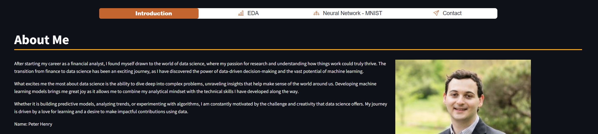

# Data Science Portfolio  
  
  

Welcome to my Data Science Portfolio! This repository showcases my skills, projects, and accomplishments in data science, with examples of real-world applications. Potential employers can explore my work and assess my capabilities in machine learning, data analysis, and visualization.

# Repository Structure
## Table of Contents
1. [Digit Recognizer](#digit-recognizer)
2. [Streamlit for Portfolio](#streamlit-for-portfolio)
3. [World Happiness Files](#world-happiness-files)
4. [How to Use](#how-to-use)
5. [About Me](#about-me)
6. [Contributions](#contributions)

## Digit Recognizer
Description:
- This folder contains my project for the Kaggle Digit Recognizer competition.

| Feature | Details |
|---------|---------|
| **Goal** | Classify handwritten digits (0-9) from the MNIST dataset |
| **Accuracy** | 99.389% on Kaggle |
| **Files** | Code, data preprocessing scripts, and results |

Highlights:
- Comprehensive analysis and model tuning.
- Achieved a competitive accuracy of 99.389% on Kaggle.

Files:
- Code, data preprocessing scripts, and results documentation.

## Streamlit for Portfolio
Description:
- This folder includes the Streamlit app I created to display my data science portfolio interactively.

Highlights:
- Demonstrates the use of Python-based Streamlit framework for creating dashboards.
- Includes various visualizations and project insights.

Files:
- Python scripts for the app, sample data, and setup instructions.

## World Happiness Files
Description:
- This folder contains my analysis of the World Happiness Report dataset. It focuses on exploring factors affecting happiness scores across countries.

Highlights:
- Data cleaning and preprocessing.
- Exploratory Data Analysis (EDA) with insightful visualizations.
Files:
- Jupyter Notebooks, visualizations (PNG files), and detailed analysis scripts.

## How to Use
Clone the repository:
### bash Script
Copy the code
- git clone https://github.com/Peter95501/Portfolio-Data_Science_Public.git
- cd Portfolio-Data_Science_Public

## About Me
  
I am a passionate data scientist pursuing a career at the intersection of machine learning, data analysis, and impactful problem-solving. With hands-on experience in building ML models, interactive dashboards, and exploratory analysis, I am constantly learning and developing innovative solutions.

Contact me with:
- [**LinkedIn**](https://www.linkedin.com/in/peter-henry-783a88121/) 
- [**Email**](mailto:peter.henry.career@gmail.com)

## Contributions
I welcome feedback and contributions! If you find something interesting or have suggestions for improvement, feel free to open an issue or a pull request.

## License
This repository is licensed under the MIT License.

Thank you for visiting my portfolio! 🌟

